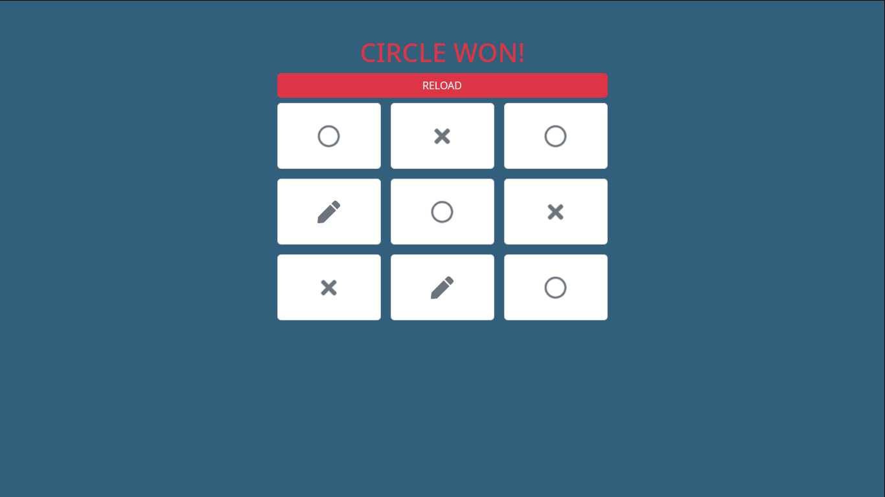

# Tic Tac Toe

A simple and fun Tic Tac Toe game built using React and Bootstrap, with animations powered by animate.css.

## Screenshot:

## Live Project

You can check out this project live on [https://sdtictactoe.netlify.app](https://sdtictactoe.netlify.app).

## Installation

To install and set up the project, follow these steps:

1. Clone the repository: `git clone https://github.com/Sduttt/tictactoe.git`
2. Install dependencies: `npm install` or `yarn install`

4. Start the development server: `npm start` or `yarn start`

## Contact

If you have any questions or want to report a bug, feel free to contact me at [subhamdutta588@gmail.com](mailto:subhamdutta588@gmail.com).

### Follow me on [Linkedin](https://www.linkedin.com/in/subham-dutta-8670b8178/) | [Github](https://github.com/Sduttt) | [Twitter](https://twitter.com/Subhamd88404337) | [Facebook](https://www.facebook.com/profile.php?id=100073951804006) | [Instagram](https://www.instagram.com/its_subham_dutta/)
